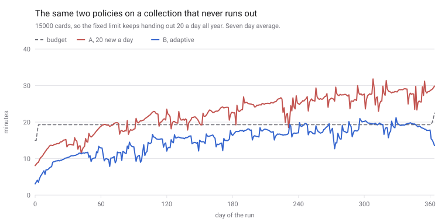

# Neuron

Spaced repetition that schedules your time, not your card count.

**Status:** early development. The foundation is in place, the app is not built yet.

<!-- Screenshot of the review screen goes here once it exists. -->

## Why

Every review app asks how many cards you want per day. That number is a guess, and the load it
creates arrives weeks later. Neuron asks how many minutes you have instead, measures how fast you
actually answer, and shapes the schedule around that.

Here is the difference, simulated over a year with the same virtual learner in both arms and only
the policy changed. The red line is a fixed limit of 20 new cards a day. The blue line is the same
learner under a 15 minute budget.



The fixed limit never settles: 18.9 minutes a day at day 90, 28.7 at day 365 and still climbing.
The budget holds at around 15 and learns 70% as many words for 67% of the minutes. That trade, and
how it was measured, is in [docs/algorithm.md](docs/algorithm.md).

## Features

<!-- Filled in as features land. -->

## Stack

| Area      | Choice                                     |
| --------- | ------------------------------------------ |
| Web       | React 19, Vite, TypeScript, PWA            |
| Api       | Hono, Drizzle, Cloudflare Workers          |
| Scheduler | Pure TypeScript, no runtime dependencies   |
| Database  | Postgres                                   |
| Tooling   | pnpm workspaces, Turborepo, Vitest, ESLint |

## Layout

```
apps/web          the application people use
apps/api          sync and account endpoints
packages/core     the scheduling algorithm, pure functions only
packages/shared   schemas and types used by both sides
packages/config   shared TypeScript, ESLint and design tokens
docs/             architecture, algorithm, design principles
```

## Getting started

Requires Node 22.13 or newer and pnpm 11 or newer.

```
pnpm install
pnpm test
```

Other commands:

```
pnpm dev          run web and api together
pnpm build        build every package
pnpm typecheck    check types across the workspace
pnpm lint         run eslint and the dependency direction check
pnpm test:core    run the scheduler tests in watch mode
pnpm format       format the repository
```

## Licence

MIT. See [LICENSE](LICENSE).
