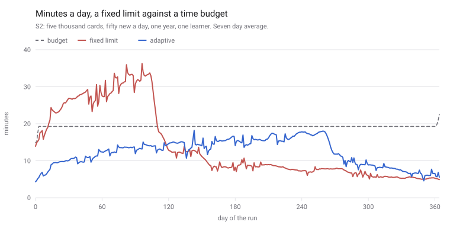

# Neuron

Spaced repetition that schedules your time, not your card count.

**Status:** Phase 7 is complete through merged PR #41, with final physical-iPhone acceptance. Collection
authoring/import, Daily Study and persistent Practice are shipped. Phase 8 Offline Collection and
Synchronization is the next milestone for planning; offline collection/sync is not implemented yet.
See [current state](docs/STATE.md) and [roadmap](docs/ROADMAP.md).

## Why

Every review app asks how many cards you want per day. That number is a guess, and the load it
creates arrives weeks later. Neuron asks how many minutes you have instead, measures how fast you
actually answer, and shapes the schedule around that.

Here is what that changes, simulated over a year with the same virtual learner in both arms and
only the policy swapped. The red line is a fixed limit of 50 new cards a day on a 5000 word list,
which is what people do after importing one. The blue line is the same learner under a budget of
15 minutes on weekdays and 30 at the weekend.



Both arms finish the year knowing the same amount: 4834 cards against 4809. **Neuron does not
teach you faster, and nothing here claims it does.** What it changes is the shape of the demand.

| over one simulated year         | fixed 50 a day | 15 minute budget |
| ------------------------------- | -------------- | ---------------- |
| worst single day                | 49 min         | 27 min           |
| worst week                      | 254 min        | 127 min          |
| days past twice what you agreed | 36             | 0                |
| cards known at day 365          | 4834           | 4809             |

Add two absences to the same year, a fortnight at day 60 and three weeks at day 150, and the day
you come back costs 162 minutes under the fixed limit against 60 under the budget, and it takes 50
days to get straight against 6.

The scenarios behind those numbers, including the one where the difference is small, are in
[docs/algorithm.md](docs/algorithm.md).

## Features

- FSRS-6 scheduling in a pure deterministic package
- Time budgets, load forecasting, new-card admission, and backlog recovery
- Organizational Folders, leaf Decks, Notes, independent Card directions and immutable review history
- Language-scoped Daily Study with Recognition, Recall, Typing and Listening; persistent non-SRS Practice
- Email/password accounts, recovery codes, optional TOTP, RLS, and restricted database roles
- Mobile-first React interface with English UI, retained English/Russian catalogues, light/dark themes and adaptive glass
- Note authoring, retry-safe chunked imports and operation-scoped collection recovery

## Stack

| Area      | Choice                                     |
| --------- | ------------------------------------------ |
| Web       | React 19, Vite, TypeScript, PWA shell      |
| Api       | Hono, Drizzle, Vercel Functions            |
| Scheduler | Pure TypeScript, no runtime dependencies   |
| Database  | Postgres                                   |
| Tooling   | pnpm workspaces, Turborepo, Vitest, ESLint |

## Layout

```
apps/web          the application people use
apps/api          sync and account endpoints
packages/core     the scheduling algorithm, pure functions only
packages/shared   schemas and types used by both sides
packages/config   shared TypeScript, ESLint and design tokens
docs/             architecture, algorithm, design principles
```

## Getting started

Requires Node 22.13 or newer and pnpm 11 or newer.

```
pnpm install
pnpm test
```

Other commands:

```
pnpm dev          run web and api together
pnpm build        build every package
pnpm typecheck    check types across the workspace
pnpm lint         run eslint and the dependency direction check
pnpm test:core    run the scheduler tests in watch mode
pnpm format       format the repository
```

## Repository presentation

To hide the Deployments section, the repository owner can open the gear beside **About** on the
repository Code page, clear **Deployments** under **Include in the home page**, and save. This changes
homepage presentation only. Preserve deployment history, environments, Vercel aliases/previews and the
GitHub integration so rollback and required deployment checks remain available.

## Licence

MIT. See [LICENSE](LICENSE).
