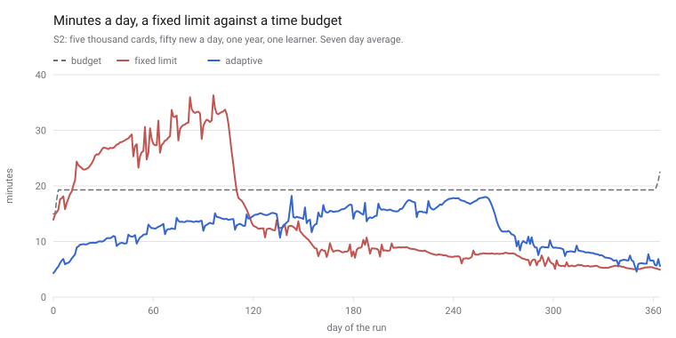
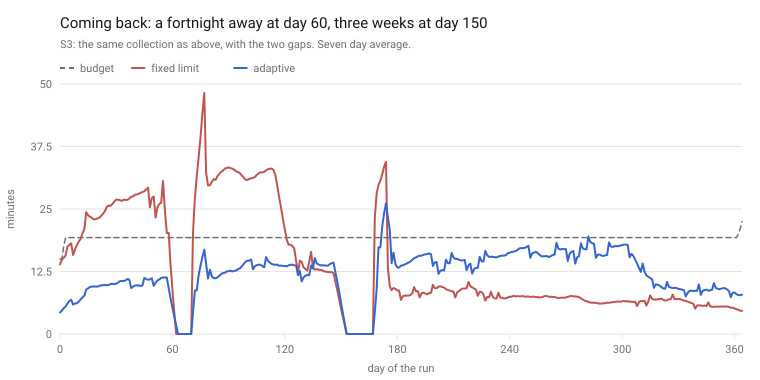
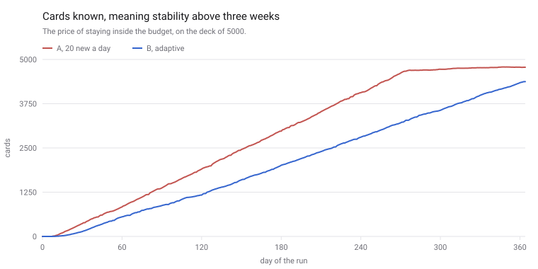
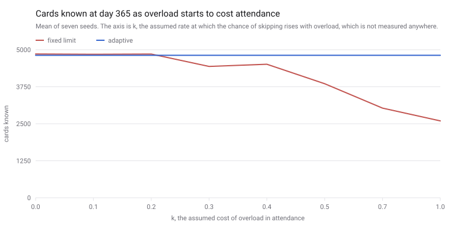
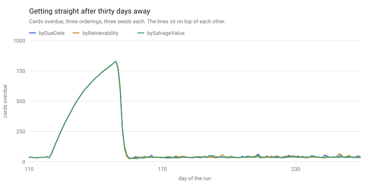

# Algorithm

Written as the scheduler is built. Two halves. The memory model decides **when**
a card should come back. The workload manager decides **how much** of that fits
in the life of the person answering it.

## FSRS-6

Neuron schedules with FSRS-6, the sixth version of the Free Spaced Repetition
Scheduler. It is a statistical model of forgetting, fitted on a public dataset of
several hundred million reviews. Nothing about it is invented here. The
implementation lives in `packages/core/src/fsrs` and is written from two sources,
both read on 2026-08-07:

- [The Algorithm](https://github.com/open-spaced-repetition/awesome-fsrs/wiki/The-Algorithm),
  the wiki of `open-spaced-repetition/awesome-fsrs`, which gives the equations.
- [ts-fsrs 5.4.1](https://github.com/open-spaced-repetition/ts-fsrs), which
  reports itself as `v5.4.1 using FSRS-6.0` and pins down what the equations
  leave open: where results are rounded, where they are clamped, and in which
  order the four buttons are separated.

FSRS-7 exists but is a research branch, so it is not used.

## Three numbers

Every card carries three values. Two are stored, one is computed on demand.

**Stability**, in days, is how long it takes for the chance of recalling the card
to fall to 90%. A stability of 30 means that in a month from the last answer you
have about a nine in ten chance of getting it right. Stability only grows on a
correct answer and only shrinks on a wrong one.

**Difficulty**, from 1 to 10, is how hard this card is for this person. It is not
a property of the word. The same word is difficulty 2 for one learner and 8 for
another. Difficulty controls how much a correct answer is worth: a difficult card
gains less stability from the same answer than an easy one.

**Retrievability** is the chance of recalling the card right now. It is not
stored. It falls from 1 on the day of the answer, following

```
R(t, S) = (1 + FACTOR * t / S) ^ DECAY
```

where `t` is the days since the last answer, `DECAY` is one of the 21 trained
weights, and `FACTOR` is whatever makes the curve pass through 0.9 at `t = S`.
That is the definition of stability, so the factor follows from the decay rather
than being fitted separately.

The curve is a power curve, not an exponential one, and this matters more than it
sounds. It has a long tail. With the fitted decay, recall reaches a coin flip only
after roughly ninety times the card's stability has passed. A card worth six
months does not evaporate over a summer. This is the reason a break in study does
not destroy progress in Neuron, and the reason no card is ever reset to the start.

## What an answer does

Four things happen when a card is answered.

**Retrievability is computed first**, from the stability the card had and the days
that passed. Everything else reads it.

**Difficulty moves.** The answer pushes it up or down by a fixed weight per step
away from Good. That push is damped by how much room is left below 10, so a card
already near the top barely moves. Then the result is pulled slightly toward a
fixed target. The pull is small, and it is the part that keeps a long run of Good
answers from driving every card in the collection to the floor. Older algorithms
had no such term, and collections drifted into a state where everything looked
easy and nothing was scheduled sensibly.

**Stability moves**, by one of three rules.

- Correct answer, a day or more since the last one: stability grows. The size of
  the jump depends most on how low retrievability had fallen. Recalling something
  you were about to forget proves much more than recalling something you saw
  yesterday, so it is worth much more. It also depends on difficulty (harder cards
  gain less), on current stability (already stable cards gain proportionally less)
  and on which button was pressed.
- Wrong answer: stability drops to a value computed from difficulty, from the
  stability the card had and from retrievability. It is small, but it is not zero
  and it is not the starting value. A card you have known for a year and then
  forget comes back stronger than a card you learned yesterday and forgot.
- Two answers on the same day: a separate rule applies, because no measurable time
  passed and the forgetting curve has nothing to say. This rule is what FSRS-6
  added over FSRS-5. Correct answers here are held to never lower stability.

**The card is placed.** A card on its first day walks through the learning steps,
which are measured in minutes and ignore stability entirely. A card in the review
state is placed by its stability. A wrong answer on a review card drops it into
the relearning steps and counts a lapse.

## Desired retention is the lever

Solving the forgetting curve for `t` at a chosen recall probability gives

```
interval = S * (target ^ (1 / DECAY) - 1) / FACTOR
```

The multiplier depends only on the target, so the interval is always a fixed
multiple of stability. At the default target of 0.90 that multiple is exactly 1,
which is why stability reads as "the interval this card has earned".

This one setting is the only real control a person has over their workload, and it
is not a linear one:

| target | interval multiplier | reviews per day, against the default |
| ------ | ------------------- | ------------------------------------ |
| 0.80   | 3.32                | 0.30                                 |
| 0.85   | 1.91                | 0.52                                 |
| 0.90   | 1.00                | 1.00                                 |
| 0.95   | 0.40                | 2.48                                 |
| 0.97   | 0.22                | 4.49                                 |

Moving from 0.90 to 0.97 costs four and a half times the daily work and buys seven
percentage points of recall. Moving from 0.90 to 0.85 roughly halves the work.
This is the trade the load manager will make visible, and it is why the setting is
capped at 0.97 rather than left open.

## Scenario A from the demo

`pnpm --filter @neuron/core demo` prints three histories. This is the first: a
card answered Good every time, with each answer given on the day the card came
due, run for a year. Fuzz is switched off so the numbers are reproducible.

| #   | date       | answer | next     | stability | difficulty | recall |
| --- | ---------- | ------ | -------- | --------- | ---------- | ------ |
| 1   | 2026-01-05 | Good   | 10 min   | 2.31      | 2.12       | first  |
| 2   | 2026-01-05 | Good   | 2 days   | 2.31      | 2.11       | 1.00   |
| 3   | 2026-01-07 | Good   | 11 days  | 10.97     | 2.10       | 0.91   |
| 4   | 2026-01-18 | Good   | 46 days  | 46.32     | 2.10       | 0.90   |
| 5   | 2026-03-05 | Good   | 163 days | 163.00    | 2.09       | 0.90   |
| 6   | 2026-08-15 | Good   | 498 days | 497.88    | 2.08       | 0.90   |

Six answers in a year. The recall column is the chance of remembering the card at
the moment the question was asked, and it holds at 0.90 the whole way down. That
is the model working: the intervals grow at exactly the rate needed to keep
hitting the target.

## How this was checked

Three layers of tests, in `packages/core/src/fsrs`.

**Differential.** `ts-fsrs` is added as a devDependency, imported only from test
files, and never reaches the application. A generator builds 20000 review
histories of up to 60 answers each, varying ratings, gaps from the same day to
400 days, target retention across its range, learning and relearning steps,
interval caps, and weights jittered off their defaults. Every history is run
through both this implementation and the reference, and the two must agree on
state, stability, difficulty, due date, review count, lapse count and step index
after every single answer. The run compares over 600000 answers.

Writing the equations from a specification is not the same as getting them right.
Twenty equations and 21 weights leave a lot of room for a formula that looks
plausible, produces reasonable looking numbers, and is wrong in a way nobody
notices for years. The differential test is the only thing standing between that
and the user.

**Properties.** Rules that must hold for every input, checked over thousands of
generated histories: stability stays above zero, difficulty stays within 1 to 10,
retrievability starts at 1 and only falls, a wrong answer never raises stability,
a wrong answer on a review card always counts a lapse, the four buttons stay in
order, the same seed gives the same schedule, preview neither mutates the card nor
consumes randomness, and replaying a log produces the same card as applying the
answers one by one.

**Regression snapshot.** One fixed history of twenty answers with a fixed seed,
with its exact intervals, stabilities and difficulties committed. It exists to
catch a change that is not wrong so much as different. If those numbers move,
someone has to decide on purpose that the move was wanted.

## Two decisions worth knowing about

**A day runs from 04:00 to 04:00 in the user's own timezone.** FSRS is fitted on
data where a day is the unit of scheduling, so two answers inside the same day
are zero days apart no matter how many hours separate them, and answers on
consecutive days are one day apart even if only minutes separate them. The
scheduler relies on this: zero elapsed days is what selects the same day rule.

Which day that is cannot be a UTC question. Somebody in Moscow answering at 02:00
local is still inside the previous UTC day, so both the same day rule and the
elapsed day count would misfire for them. The timezone and the cutoff hour are
settings, the day index is computed with `Intl` and nothing else, and it is
tested across both directions of a daylight saving change and in a timezone whose
offset is not a whole number of hours. The cutoff defaults to 04:00 because a
session that runs past midnight should count as one day, which is also the
convention the model was trained against.

**The interval cap has one documented exception.** Intervals are held to the
configured maximum, but the rule that keeps Good longer than Hard and Easy longer
than Good is applied after that cap. A card whose every interval has already
reached the cap therefore comes out one day past it on Good and two on Easy. This
is what the reference implementation does, and the alternative is worse: three
buttons that all promise the same date.

## Replay and offline

The `reviews` table is append only, and card state is a projection of it.
`replay(logs, config)` is that projection: it rebuilds a card from nothing but its
review log. This is what makes offline sync work. When two devices answer the same
card while offline, the logs are merged by timestamp and replayed, and both
devices arrive at the same card without either one having to win.

Stability and difficulty are recomputed during a replay, because they are a
function of the log and every device computes them identically. The due date is
not. Fuzz and load balancing both draw from a generator, so the day a card
actually landed on exists nowhere except in the row that recorded it, and each
row therefore stores it. Without that, a phone that scattered a card onto Tuesday
and a laptop rebuilding the same card onto Monday would both be self consistent
and a day apart forever, and nobody would notice for months. A test replays five
thousand generated histories with fuzz on and requires the state, the stability,
the difficulty and the due date to match exactly; fuzz had moved the card in 3772
of them.

---

# The workload manager

FSRS decides when a card should come back. It has nothing to say about whether
the day it lands on already holds two hours of work, and that is the part people
actually quit over.

Every review application asks the same question at setup: how many new cards a
day. It is an unanswerable question. The number is a guess about work that
arrives weeks later, through a chain nobody can hold in their head: twenty new
cards today is sixty answers this week, and in two months it is a review load
that has nothing to do with the twenty. By the time the cost shows up, the cause
is forty days behind you.

Neuron asks for minutes instead, because minutes are something a person knows
about themselves, and derives the card count from them. Six pieces do that.

## 1. How long an answer takes

Everything downstream is measured in minutes, so the whole thing rests on this.
It is measured, not assumed. The review log already records how long every answer
took, and it is read per direction and per card state: recognising a word you are
shown and typing it from nothing are not the same task, and one estimate for both
is wrong for both.

Three decisions.

The **median**, not the mean. A review interrupted by a phone call is recorded as
four minutes of thinking, and a handful of those would drag a mean past anything
real.

**The slowest twentieth is dropped** before the median is taken. The median
already survives outliers; the trim keeps the estimate steady on the small
samples where two interruptions are a large share of everything you have.

**The measurement is blended into the default**, not switched to. The weight
moves linearly from the default to the measurement over the first twenty answers
of that kind. A hard threshold would make the forecast lurch the moment somebody
crossed it, for no reason they could name.

Defaults before anything is measured, in seconds: recognition 4, recall 6,
production 12, cloze 10, listening 6.

## 2. The forecast

The obvious way to build a forecast is to bucket the due dates that already exist
and add up the minutes. That is what makes every other application's forecast
graph wrong, and wrong in one direction. A card reviewed tomorrow produces
another review a few days later, and that one produces another.

The share this misses is measured in the tests rather than guessed at: on a
collection of 200 cards over sixty days, 409 reviews happen and 200 of them are
on the calendar today. **Half the work does not exist yet.** A throttle built on
the buckets alone would let in twice as much as it meant to.

So the forecast simulates forward. Every card is carried through the horizon with
the real scheduler, and every review it will spawn is counted.

**Expected value** is the mode the application runs. Each answer splits into all
four ratings at once, each branch carrying a fraction of the card, weighted by
how often this person actually presses each button. That distribution comes from
their own log, with a prior worth twenty reviews standing in until there is
enough of it (0.08 Again, 0.10 Hard, 0.75 Good, 0.07 Easy).

Three things keep it cheap enough to run on a phone.

- **Branches lighter than 0.0001 of a review are dropped**, and their weight is
  handed to the branches that survive rather than evaporating. The likeliest
  answer is always followed however thin its branch has become, so a card can
  never quietly disappear from its own forecast.
- **A card may leave at most four branches on any one day.** The fifth to arrive
  is merged into whichever it is nearest in stability.
- **Merged stabilities are averaged harmonically, not arithmetically.** What the
  forecast counts is reviews per day, which is proportional to one over the
  interval, which is proportional to one over stability. Averaging a branch worth
  two days with one worth twenty would produce a branch worth eleven, doing about
  half the work of the two it replaced. Averaging the rates keeps the work.

That makes the pass linear in cards times horizon. Measured: fourteen days of a
2000 card collection takes about 25 ms, sixty days about 400 ms. The throttle runs
the fourteen day version on every app open; the sixty day version is for the
graph.

**Monte Carlo** is the honest and slow mode. Cards take one path each, drawn from
a seeded generator, and many runs are averaged. It exists to check the cheap mode,
and a test holds the two to agree within 5% on total minutes and 10% on the mean
day of the first fortnight. In practice they agree within about 1.5%. The
agreement is not free: at a prune threshold of 0.001 the cheap mode came out 4%
low, which is what settled 0.0001 as the default.

## 3. The budget

Minutes offered per weekday. The default is 15 on a weekday and 30 at the
weekend. Unused minutes from the last seven days can be carried into today,
capped at one extra day's worth, and only counting days after the person's first
review: somebody who installed the application yesterday has not been skipping
sessions.

## 4. What one new card costs

```
marginalCostOfNewCard(config, logs, now, direction) -> minutes a day
```

One new card is walked through the forecast on its own, and everything it causes
over the horizon, the learning steps today and every review it spawns after, is
added up and spread across the horizon. This is the honest answer to "what does
one more word actually cost me", and it is personal: it uses this person's answer
speed and this person's habit of pressing Again.

The throttle then averages the forecast over the next fourteen days, compares it
to the average budget over the same fortnight, and divides the room that is left
by the price of a card. Four fifths of the budget is the ceiling, not all of it,
because a schedule with no slack in it turns one bad week into a backlog.

The answer comes back with its reasoning attached, as an enum the interface turns
into a sentence in either language:

```
{ allowed, headroomMinutes, marginalCost, reason }

withinBudget | forecastOverBudget | backlogActive | dailyCapReached
```

## 5. Load balancing

FSRS says twelve days. It does not mean twelve rather than eleven or thirteen:
the forgetting curve is nearly flat across those three and the difference in
recall is well under a percentage point. The calendar is not flat. Cards learned
on the same evening come back on the same evening forever, and one Sunday ends up
with four times the work of the Mondays either side of it.

So within a narrow window around the ideal interval, plus or minus ten percent
and never less than a day either side, the least loaded day wins. Ties go to the
day nearest what the scheduler asked for, and only then to the generator.

This **replaces** fuzz rather than joining it. Both exist to stop cards piling
onto one day, and running both would mean one of them scattering a card off the
day the other had just chosen for it. Turning balancing on turns fuzz off, in the
settings constructor, where it cannot be forgotten.

## 6. Coming back after a month

Overdue work worth more than three days of budget stops being a to do list and
becomes a state. New cards stop while it lasts, because adding to a pile you are
already behind on is the one thing that cannot help, and the work is spread over
however many days it takes at the day's budget, capped at fourteen.

Ordering is the interesting part, and three are implemented behind one interface:
oldest first, lowest chance of recall first, and a salvage heuristic that prefers
cards where reviewing now preserves the most, meaning high stability cards whose
recall has fallen into the middle band. Which one is the default was decided by
measurement, below.

## The session

The last step, and the only one anybody sees. Reviews first, new cards filling
what is left. New cards spread through the first two thirds rather than blocked
at the front, since a wall of unfamiliar cards at the start is where sessions get
abandoned and the last third is where attention is thinnest. Never two cards of
one note in a session, because the second would be a hint rather than a test.
Never three cards above difficulty 8 in a row. Overdue cards mixed in rather than
piled at the front. And the session ends on a whole card, even if that goes a
little over, because stopping mid card to respect a budget to the second would be
worse than twenty seconds of overshoot.

## What the simulator measured

`pnpm --filter @neuron/core simulate` runs a virtual learner through a year under
each policy and prints the tables below. Every number in this section came out of
that run.

Two things have to be said before any of them.

**The circularity.** Whether the virtual learner recalls a card is decided by the
scheduler's own estimate of how likely they are to recall it. The model both sets
the exam and marks it, so none of this is evidence that FSRS is right about human
memory, and nothing here claims it is. What it can measure is one policy against
another, because the model is identical in both arms and only the policy differs.
A reader who spots that themselves and finds it unacknowledged would be right to
discount everything else on the page.

**What is not being claimed.** The first round of runs compared the two policies
on words learned per minute and found them level. That result stands, and on
reflection it could not have gone any other way: the rate at which a schedule
turns minutes into memories belongs to FSRS, and a throttle that rations the
minutes cannot beat arithmetic. Neuron does not teach faster. Nothing below says
it does.

What a throttle can change is the shape of the load, and that is what the tables
measure.

Two results carry the argument, and they are the two to read first.

**The same amount is learned either way.** Across all five scenarios the two
policies end the year within 1.9% of each other on cards known, and in S1 the
adaptive arm is the one ahead. Whatever the throttle costs, it is not knowledge:
it holds new cards back exactly while the collection cannot afford them, and the
year comes out level.

**Coming back from a fortnight away takes six days instead of fifty.** In S3 the
adaptive arm is inside its budget again six days after the absence at day 60
ends. The fixed limit takes fifty. That is the difference between a return with
an end in sight and one without, and coming back is the moment collections get
abandoned in real life.

The second absence in that scenario, three weeks from day 150, goes the other
way: seven days for the fixed limit against nine for the throttle. Worth
understanding rather than skipping past. By day 171 the fixed arm has been out of
new cards for two months and its load is falling on its own, so it has less to
recover from. Six against fifty is the honest version of this claim, and it comes
from one absence rather than from both.

The load shape numbers, the worst day and the worst week, come after those two.
They are real, they are between 1.3 and 2.7 times apart, and they are the weaker
argument: the size of the gap depends heavily on how fast the person answers,
and this learner is fast.

### The conditions

The learner answers a recognition card in 5 seconds, a recall card in 7 and a
typed one in 14, with a spread around each. They skip one day in twenty. The
budget is 15 minutes on a weekday and 30 at the weekend, which averages 19.3
minutes a day. Both arms of every scenario share a seed, so they are the same
person having the same luck.

The fixed arm is how other applications work: every review that comes due, plus
each deck's own limit in new cards. The adaptive arm is this package: a session
that stops at the budget, and new cards only while the forecast says there is
room.

### The five scenarios

Minutes a day, and what the year cost.

| scenario                   | policy   | mean | median | p95 | worst day | worst week | past 2x | over by |
| -------------------------- | -------- | ---- | ------ | --- | --------- | ---------- | ------- | ------- |
| S1 burst import, 500 cards | fixed    | 2.3  | 1.0    | 16  | 20        | 127        | 0       | 0.1     |
| S1                         | adaptive | 2.3  | 1.3    | 9   | 10        | 68         | 0       | 0.0     |
| S2 Oxford 5000             | fixed    | 13.9 | 8.9    | 34  | 49        | 254        | 36      | 3.1     |
| S2                         | adaptive | 12.2 | 13.6   | 18  | 27        | 127        | 0       | 0.5     |
| S3 two absences            | fixed    | 13.7 | 8.1    | 33  | 162       | 337        | 34      | 3.6     |
| S3                         | adaptive | 11.9 | 13.3   | 20  | 60        | 183        | 3       | 0.8     |
| S4 production heavy        | fixed    | 18.2 | 11.4   | 47  | 82        | 370        | 59      | 5.8     |
| S4                         | adaptive | 14.9 | 16.0   | 22  | 32        | 155        | 0       | 1.5     |
| S5 three decks             | fixed    | 11.5 | 8.6    | 22  | 35        | 172        | 3       | 1.2     |
| S5                         | adaptive | 10.7 | 10.3   | 17  | 27        | 127        | 0       | 0.3     |

`past 2x` counts days that went past twice the budget. `over by` is how far past
the budget the average day went, counting days under it as zero.

**A count of days over budget is deliberately not in that table**, although the
simulator still prints one. It counts a session of 15 minutes and 4 seconds
against a budget of 15 minutes as a day over budget, which is true and useless.
Under it the adaptive arm looks worse in S4, 153 days against 124, while being
better on every measure of how far over: 1.5 minutes on the average day against
5.8, and never past double against 59 days past double. The reason is the whole
card rule. A session fills the budget and then finishes the card it is on, so it
crosses the line by seconds nearly every day, while the fixed arm spends the
first two months well under the line and the rest of the year far over it. A
threshold that a design deliberately sits on is not a threshold worth counting
crossings of, so what is reported is magnitude.

And what came out of the same runs.

| scenario | policy   | new cards | known at day 365 | reviews | hours | retention |
| -------- | -------- | --------- | ---------------- | ------- | ----- | --------- |
| S1       | fixed    | 500       | 479              | 3448    | 6.9   | 90.4%     |
| S1       | adaptive | 500       | 483              | 3446    | 7.0   | 89.1%     |
| S2       | fixed    | 5000      | 4834             | 43161   | 84.7  | 89.2%     |
| S2       | adaptive | 5000      | 4809             | 37076   | 74.4  | 89.3%     |
| S3       | fixed    | 5000      | 4838             | 42297   | 83.4  | 89.0%     |
| S3       | adaptive | 5000      | 4749             | 35919   | 72.5  | 88.6%     |
| S4       | fixed    | 4500      | 4337             | 39121   | 110.8 | 89.1%     |
| S4       | adaptive | 4500      | 4269             | 31043   | 90.7  | 88.9%     |
| S5       | fixed    | 4200      | 4058             | 35619   | 70.1  | 89.1%     |
| S5       | adaptive | 4200      | 4028             | 32641   | 65.1  | 89.2%     |

The scenarios, and what each one is for.

**S1, burst import.** Five hundred cards imported at once, fifty a day, six
months. Small enough that both policies clear it, and the difference is a worst
day of 20 minutes against 10. This is the scenario where the throttle matters
least, which is worth knowing.

**S2, the Oxford 5000.** The situation the application exists for. Same cards
known to within half a percent, and 36 days of the year past twice the promised
time against none.

**S3, two absences.** A fortnight away at day 60 and three weeks at day 150. The
day you come back costs 162 minutes under the fixed limit and 60 under the
throttle, and the recovery takes 50 days against 6 after the first absence, 7
against 9 after the second. The second row is the one worth noticing: the fixed
arm gets straight two days quicker there, because by day 171 its deck has run out
of new cards and the load was falling anyway.

**S4, production heavy.** Every note gives three cards including a typed one at
14 seconds. This is where the fixed limit hurts most, 59 days past double the
budget, and the throttle's worst day is 32 minutes against 82.

**S5, three decks.** English at 20 new a day, German at 10, finance at 5. Every
one of those is modest, and the fixed arm applies each to its own deck, which is
what every application does. The summation shows up but it is the mildest of the
five: a worst day of 35 against 27. At these limits three reasonable decks add up
to something still close to reasonable.

One result in those tables cuts against the design, and it stays in.

**The adaptive arm gets slightly more out of an hour**, 65 cards known per hour
against 57 in S2. It reviews cards a little later than the fixed arm does, and
FSRS pays more for a later review. It is a real number and it is not the point:
the effect is small, it comes out of the same model that is being used to judge
it, and the design does not depend on it.







### If overload costs attendance

Everything above assumes the learner turns up just as often on a day that wants
ninety minutes as on one that wants fifteen. That assumption is the one most
favourable to the fixed limit, and it is why the two policies come out level on
words learned.

It is also not what anybody believes about people. So the simulator carries an
optional behavioural model, kept in its own type and clearly marked as an
assumption rather than a measurement:

```
chance of skipping = clamp(baseSkip + k * max(0, load / budget - 1), 0, maxSkip)
abandon the collection after 21 consecutive skipped days
```

with `baseSkip` 0.05 and `maxSkip` 0.9. Days the scenario says the learner was
away do not count towards abandonment: a holiday is a stated fact, not evidence
of having given up.

`k` is unknown. Nobody has measured it, this simulation certainly has not, and
picking a flattering value and reporting the result would be worthless. So it is
swept.

Giving up turned out to be a threshold rather than a slope: a run either survives
the year or hits three weeks of silence and ends, and which one happens at a
given `k` is largely the dice. One seed per value produced a table that jumped
between 4843 and 1639 and back with no pattern in it. Every value is therefore
seven runs with seven seeds, reported as a mean and a count of how many were
abandoned.

The adaptive arm is run once across those seven seeds and reused for every `k`.
Under a session capped at the budget the overload term is zero by construction,
so `k` multiplies zero and the runs come out identical. That is worth holding on
to while reading the table, and it is taken up again underneath it.

| k   | fixed, known | gave up | adaptive, known | gave up | fixed, days studied | adaptive |
| --- | ------------ | ------- | --------------- | ------- | ------------------- | -------- |
| 0.0 | 4856         | 0 of 7  | 4813            | 0 of 7  | 350                 | 344      |
| 0.1 | 4846         | 0 of 7  | 4813            | 0 of 7  | 340                 | 344      |
| 0.2 | 4854         | 0 of 7  | 4813            | 0 of 7  | 331                 | 344      |
| 0.3 | 4435         | 2 of 7  | 4813            | 0 of 7  | 255                 | 344      |
| 0.4 | 4510         | 2 of 7  | 4813            | 0 of 7  | 250                 | 344      |
| 0.5 | 3852         | 4 of 7  | 4813            | 0 of 7  | 173                 | 344      |
| 0.7 | 3028         | 6 of 7  | 4813            | 0 of 7  | 99                  | 344      |
| 1.0 | 2596         | 7 of 7  | 4813            | 0 of 7  | 63                  | 344      |



Read it as the simulator prints it:

> The two policies are equivalent when overload does not affect behaviour. The
> adaptive policy overtakes the fixed limit on cards known at day 365 once the
> probability of skipping rises with overload at a rate above k = 0.3. Whether
> real learners sit above or below 0.3 is an empirical question this simulation
> cannot answer.

**That result is partly structural, and it has to be said before anybody works it
out for themselves.** The dropout model is driven by overload and by nothing
else. The adaptive policy is defined by not overloading. So the only mechanism
that does any damage in this model is the one mechanism the adaptive policy
removes by construction, and no value of `k` can touch it. That is also why its
column is flat across the whole sweep: the overload term is zero, so `k`
multiplies zero.

What that makes the sweep is a consistency check, not evidence. It confirms that
the pieces behave the way the design says they do: overload is what the model
punishes, and the throttle removes overload, so the throttle is not punished.
That is internal consistency. It is not external validity, and it does not show
the policy helps for any reason other than avoiding overload.

A different assumption would produce a different answer, and some of them would
go the other way. If people abandon collections out of boredom rather than
overload, a throttle that holds new cards back is the thing doing the harm. If
what drives them off is the size of a backlog rather than the length of a
session, the ranking depends on numbers neither model has. Nothing here rules
those out.

What is left standing when the behavioural model is thrown away entirely are the
scenario tables above, where the learner never quits and the two policies still
differ by a factor on every measure of magnitude. Those numbers do not depend on
any of this.

For a sense of scale on the number itself, k = 0.3 means a day carrying twice its
budget is skipped 35% of the time instead of 5%. That does not sound outlandish,
which is exactly why it must not be presented as a finding. It is an assumption
with a number attached, and the honest version of this claim ends at the quoted
sentence above.

### The three backlog orderings

A collection four months old, thirty days of silence from day 120, then the
recovery. Three seeds for each ordering, because one run of anything is an
anecdote. The spread across the seeds is in brackets.

| ordering         | overdue at +14 | at +30        | retention after         | known at end        |
| ---------------- | -------------- | ------------- | ----------------------- | ------------------- |
| byDueDate        | 24 (20 to 27)  | 24 (21 to 27) | 89.38% (89.21 to 89.70) | 3715 (3686 to 3747) |
| byRetrievability | 22 (21 to 23)  | 24 (23 to 26) | 89.55% (89.00 to 89.91) | 3706 (3669 to 3737) |
| bySalvageValue   | 35 (23 to 58)  | 34 (19 to 64) | 89.22% (88.70 to 89.54) | 3722 (3710 to 3739) |



**The ordering does not matter.** Every difference between the three sits inside
the spread of its own seeds. On the chart the three lines lie on top of each
other.

So the default is `byDueDate`, on the grounds that it is the simplest, the
cheapest to compute and the only one of the three a person can predict without
being told the rule. The other two stay in the code as measured alternatives
rather than as folklore. `bySalvageValue` is the one that sounded cleverest and it
is the noisiest of the three, which is the whole argument for measuring instead of
debating.

One thing fell out of building it. The salvage heuristic assumes a band of cards
that have fallen so low they are mostly lost already, and FSRS-6's curve barely
produces one: a card worth a year is still at 0.86 after two months of silence,
and it takes roughly ninety times its stability to reach a coin flip. In a real
backlog the only cards below two thirds are the ones that never took hold in the
first place.

### What is actually being claimed

Written out, so that it can be checked against the tables above.

Written out in the order they deserve, so that they can be checked against the
tables above.

- **The same amount learned, either way.** Within 1.9% on cards known in every
  scenario, 0.5% in S2, and ahead in S1. Nothing is given up for the rest of this
  list.
- **Recovery from an absence as a plan with an end.** Six days against fifty
  after the fortnight away in S3. After the three weeks away later in the same
  run it is nine days against seven, for the reason given above.
- **A daily cost the person chooses and the system holds to.** Never past twice
  the budget in four of the five scenarios and three days in the fifth, against
  36 days in S2, 34 in S3 and 59 in S4 under a fixed limit. The average day ends
  at most 1.5 minutes past the budget, against up to 5.8.
- **A forecast of what the next sixty days cost**, before committing to anything.
- **A worst day 1.3 to 2.7 times smaller**, and a worst week 1.4 to 2.4 times
  smaller, depending on the scenario. Last on the list on purpose: the size of
  the gap depends on how fast the person answers, and the small end of both is
  S5, where three modest deck limits add up to something a budget barely improves
  on.

And what is not claimed: that it teaches faster, that it beats FSRS at anything,
or that the behavioural model above is a finding rather than an assumption whose
result follows from its own shape.

## How this was checked

The tests for the workload manager are in `packages/core/src/workload` and
`packages/core/src/simulation`, next to the code.

The two that carry the most weight. **Expected value against Monte Carlo**, which
is the only thing standing between a fast approximation and a forecast that is
quietly half the truth. And **the simulator's own reproducibility**: the same seed
gives the same year to the minute, so a difference between two arms is the policy
and never the dice.
